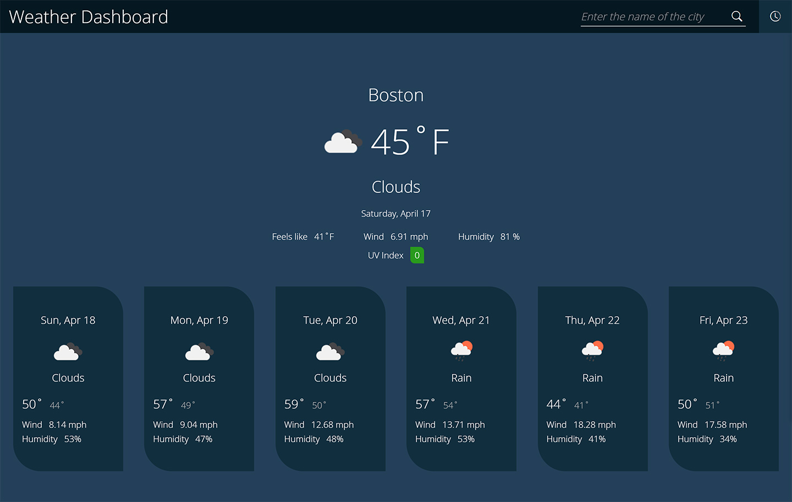

# Weather Dashboard

**Author: _Oleksandr Kulyk_**

**Preview link** - https://alexkuwerz.github.io/unh-weather-dashboard/

## Description

Simple weather dashboard that display weather data from [OpenWeather API](https://openweathermap.org/api/). User can search weather data by city name. When user enter a city name into search bar, then information appears on a dashboard. In a sidebar menu user can see search history (searched city names). The user search history store in a local storage. By clicking on each city name, the application will display weather data about this city.

## Technologies

HTML, CSS, JavaScript.

## Third Party Libraries/API's

[jQuery](https://jquery.com/), [Day.js](https://day.js.org/), [Google Fonts](https://fonts.google.com/), [OpenWeather API](https://openweathermap.org/api/)

## Preview Images

* **Page View**

